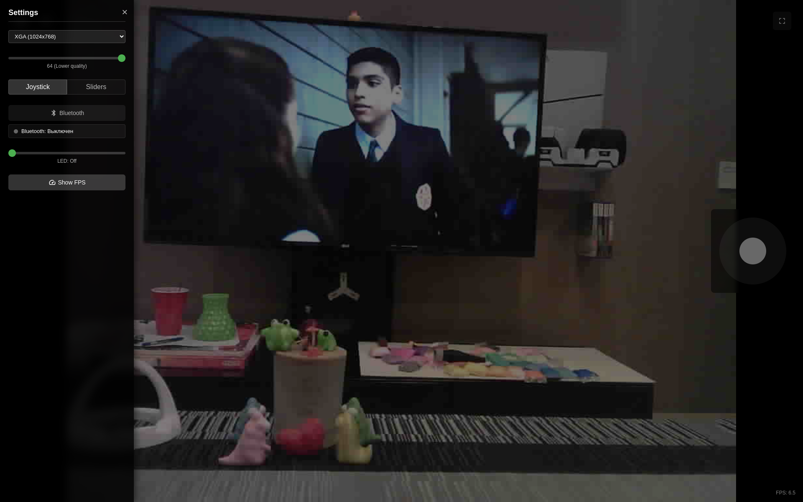
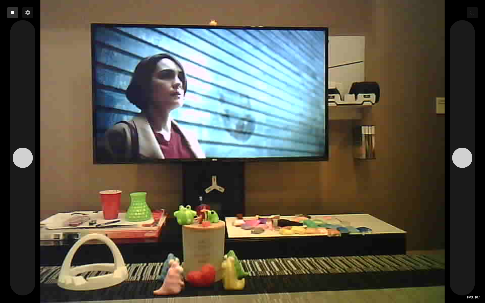
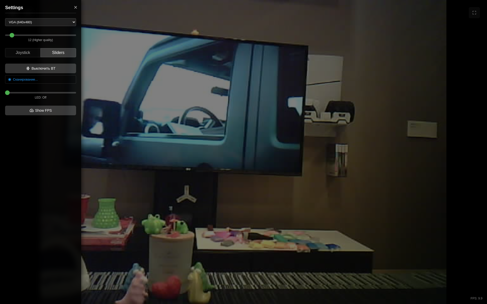

# ESP32-CAM Robot Control with Live Video Streaming



+Русская версия: [readme.ru.md](readme.ru.md)

## Overview

This project implements a remote-controlled robot using an ESP32-CAM board. It features real-time video streaming from the ESP32-CAM and controls two motors. The robot can be controlled via a web interface using either a virtual joystick, sliders for motor control, or a physical Bluetooth controller. The web interface also provides controls for video quality settings and LED brightness adjustment.

## Features

* **Live Video Streaming:** Streams camera feed in real-time through HTTP multipart response
* **Dual Motor Control:** Controls two DC motors, enabling movement in all directions
* **Multiple Control Methods:**
  * **Web Interface Joystick:** Intuitive virtual joystick control
  * **Web Interface Sliders:** Fine-grained control over individual motors
  * **Bluetooth Controller:** Support for physical Bluetooth controllers (e.g., ExpressLRS Joystick)
* **Adjustable Video Settings:** Multiple resolution options (from QQVGA to UXGA)
* **LED Brightness Control:** PWM-based control of LED
* **Resource Monitoring:** Optional FreeRTOS task statistics for performance analysis
* **Feature Toggles:** Easily enable/disable features in configuration





## Architecture

The project is built on the ESP32 Arduino framework and utilizes FreeRTOS for multitasking:

### Core Components

* **Camera Management (`camera_config.h`, `main.cpp`):**
  * Handles camera initialization and configuration
  * Configures hardware pins and camera parameters

* **Motor Control (`motor_control.h`, `motor_control.cpp`):**
  * Controls motor direction and speed through PWM
  * Processes input from joystick/sliders with deadzone handling
  * Implements smooth acceleration and turning algorithms

* **Web Server (`http_server_task.h`, `http_server_task.cpp`):**
  * Serves the embedded web interface
  * Handles control API endpoints for motors, camera settings, and LED
  * Manages video streaming requests

* **Video Streaming (`stream_task.h`, `stream_task.cpp`):**
  * Captures and streams camera frames in MJPEG format
  * Optimized for performance on the ESP32's limited resources

* **Bluetooth Control (`bluetooth_task.h`, `bluetooth_task.cpp`):**
  * Scans for and connects to Bluetooth controllers
  * Processes controller input and translates to motor commands
  * Provides connection status feedback

* **WiFi Connection (`wifi_manager.h`, `wifi_manager.cpp`):**
  * Manages WiFi connectivity with reconnection handling
  * Uses credentials from environment variables

### System Architecture

* **Multi-Core Utilization:**
  * Web server and UI handling runs on core 0
  * Video streaming and motor control runs on core 1
  * Tasks are balanced for optimal performance

* **Embedded Web Interface:**
  * HTML/CSS/JS interface is compressed and embedded in the firmware
  * No need for external file storage
  * Interface is generated during build process from `data/html/index.html`

## Hardware Requirements

* ESP32-CAM development board
* L298N / L293D or similar motor driver
* DC motors (2x)
* Power supply for ESP32-CAM (5V)
* Power supply for motors (according to your motors, typically 6-12V)
* Optional: Bluetooth joystick controller (ExpressLRS Joystick compatible)

## Setup and Installation

### Prerequisites

* PlatformIO IDE (recommended)
* USB-to-TTL converter for ESP32-CAM programming (or ESP32 development environment set up)

### Configuration

1. **WiFi Settings:**
   * Create a `.env` file in the root directory:
   ```
   WIFI_SSID="YOUR_WIFI_SSID"
   WIFI_PASSWORD="YOUR_WIFI_PASSWORD"
   ```

2. **Feature Selection:**
   * Modify feature toggles in `include/config.h`:
   ```cpp
   #define FEATURE_BLUETOOTH_ENABLED 1  // Set to 0 to disable
   #define FEATURE_LED_CONTROL_ENABLED 1
   #define FEATURE_TASK_STATS_ENABLED 0
   ```

3. **Hardware Configuration:**
   * Motor pins and PWM channels are defined in `include/config.h`
   * LED settings can be adjusted in `include/config.h`
   * Some other serrings also available in `include/config.h`

### Building and Flashing

**Using PlatformIO:**
```bash
# Build the project
pio run

# Upload to ESP32-CAM
pio run --target upload
```

### Wiring Guide

**L298N Motor Driver Connection:**
* **ESP32-CAM** → **L293D**
  * GPIO12 → IN1 (Left motor forward)
  * GPIO13 → IN2 (Left motor backward)
  * GPIO15 → IN3 (Right motor forward)
  * GPIO14 → IN4 (Right motor backward)
  * GND → GND
  * Motor power should be separate from ESP32-CAM power

## Using the Robot

1. **Connect to the robot:**
   * Power on the ESP32-CAM
   * Connect to the same WiFi network
   * Find the ESP32-CAM's IP address from the serial monitor output
   * Open a web browser and navigate to the IP address

2. **Web Interface Controls:**
   * **Start/Stop Stream** - Begin/end video streaming
   * **Control Mode** - Switch between joystick and slider control
   * **Joystick** - Drag to control direction and speed
   * **Sliders** - Adjust left and right motor speeds individually
   * **Video Settings** - Change resolution for better quality or performance
   * **LED Control** - Adjust brightness of the onboard LED
   * **Bluetooth** - Connect to a physical Bluetooth controller

3. **Using Bluetooth Controller:**
   * Enable Bluetooth in the web interface
   * Power on your compatible Bluetooth controller
   * The ESP32-CAM will scan and connect automatically
   * Use the controller to drive the robot

## Troubleshooting

* **Video Streaming Issues:**
  * Reduce resolution for more stable streaming
  * Ensure stable WiFi connection

* **Bluetooth Connection Fails:**
  * Ensure your controller is compatible
  * Check the name of BT joystick in config.h